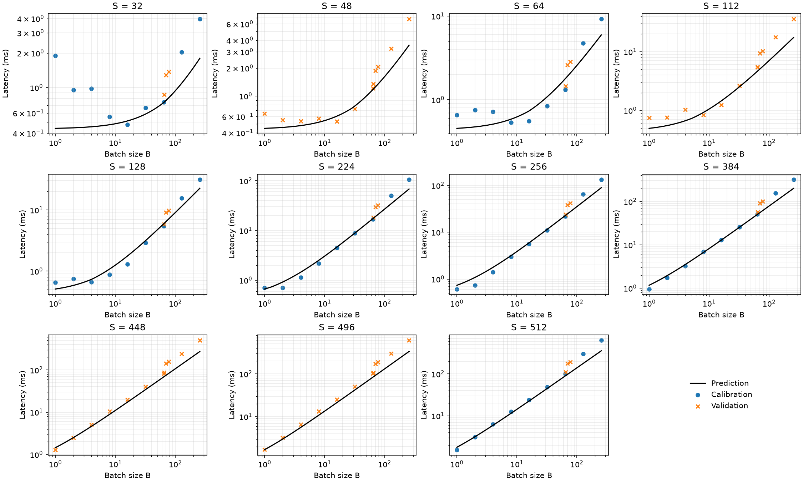

# Аналитическая модель производительности CNN

Домашняя работа №1 - Сравнение выведенных аналитически значений с реальными

## Эксперимент

Замеры выполнены в Google Colab на **Tesla T4**: случайные входы, FP32,
`eval()` и `inference_mode()`, отключённые TF32 и `cudnn.benchmark`.
После 10 прогревов время считалось как медиана 20 wall-clock замеров через
`time.perf_counter()` с синхронизацией GPU до и после прохода. Память — через
`max_memory_allocated()`, энергия — по NVML всей GPU, без вычитания фонового потребления.

Все 132 конфигурации измерены успешно: 63 использованы для калибровки, 69 — для проверки.
Дополнительные S = 48, 112, 448, 496 и B = 65, 70, 78 выбраны с seed = 42.
OOM в этом прогоне не было. Версии PyTorch/CUDA в CSV не сохранены.

## Результаты

FLOPs и память рассчитаны по структуре сети. В FLOPs включены арифметические операции
свёрток, линейных слоёв и GlobalAvgPool; один MAC принят за 2 FLOPs.
ReLU и MaxPool выполняют сравнения и выбор значения, которые по принятому соглашению
не включаются в FLOPs. GlobalAvgPool учитывается, поскольку содержит сложения и деление.
Вклад ReLU и MaxPool в память и трафик учтён, а замеры проводились на полной сети.

Для времени использована roofline-модель
с постоянными затратами запуска, для энергии — линейная зависимость от FLOPs и трафика.
Такие приближения позволяют проверить основные ограничения сети без моделирования каждого CUDA-ядра.
Параметры подбирались по относительной ошибке только на калибровочной сетке.

| Метрика на проверочной сетке | MAE | MAPE |
|---|---:|---:|
| Время | 22,110 мс | 25,58% |
| Память | 168,983 MiB | 38,22% |
| Энергия | 1,3390 Дж | 22,80% |

При малых входах заметна стоимость запуска. Дальше время и энергия растут вместе с нагрузкой,
но FLOPs и трафик почти пропорциональны BS². Поэтому модель плохо разделяет memory-bound
и compute-bound режимы. Нулевой коэффициент при FLOPs в модели энергии тоже не означает
отсутствия затрат на вычисления: два признака объясняют почти один и тот же рост.

Модель занижает память во всех точках: в формуле нет workspace cuDNN и округления аллокатора.
Максимальный измеренный пик — 5,75 GiB при S = 512, B = 256; прогноз — 4,25 GiB.
Проверить предсказание OOM по этому прогону нельзя: все конфигурации поместились в память.

Гладкая формула также не воспроизводит скачки времени. Например, при S = 496 увеличение
B с 65 до 70 меняет время со 106 до 173 мс, хотя число операций растёт лишь на 7,7%.
Возможная причина — смена алгоритма или эффективности GPU; по одному CSV установить её нельзя.



Графики [памяти](results/figures/memory.png) и [энергии](results/figures/energy.png)
построены аналогично: линия — прогноз, синие точки — калибровка, оранжевые — проверка.

## Файлы

| Файл | Содержание |
|---|---|
| `models.py` | Архитектура CNN |
| `equations.py` | Аналитически выведенные формулы |
| `measure.py` | Замеры на GPU|
| `calibrate.py` | Подбор параметров и расчёт ошибок |
| `plots.py` | Графики по сетке |
| `results/` | Замеры `measurements.csv`, параметры `theta.json`, ошибки `metrics.json` и графики |

Воспроизведение на T4; для пересчёта сохранённого CSV достаточно последних двух команд:

```bash
python -m pip install -r requirements.txt
python measure.py
python calibrate.py
python plots.py
```
